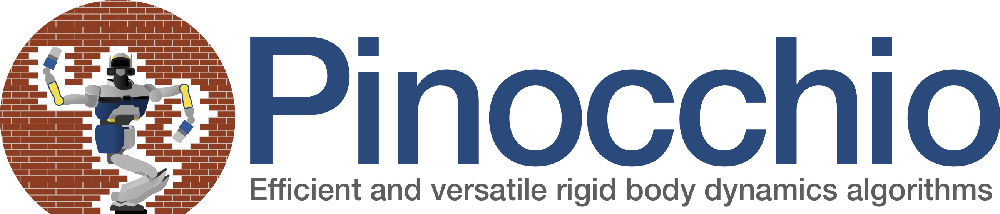

# Beautiful Bullet
Robotics simulator based on Bullet Physics Engine

## ToDo
- Delete copy constructor Agent and Object
- Fix Franka URDF
- Check memory allocation
- Add visualization collision objects (implement imgui in magnum-dynamics)
- Remove debug messages

